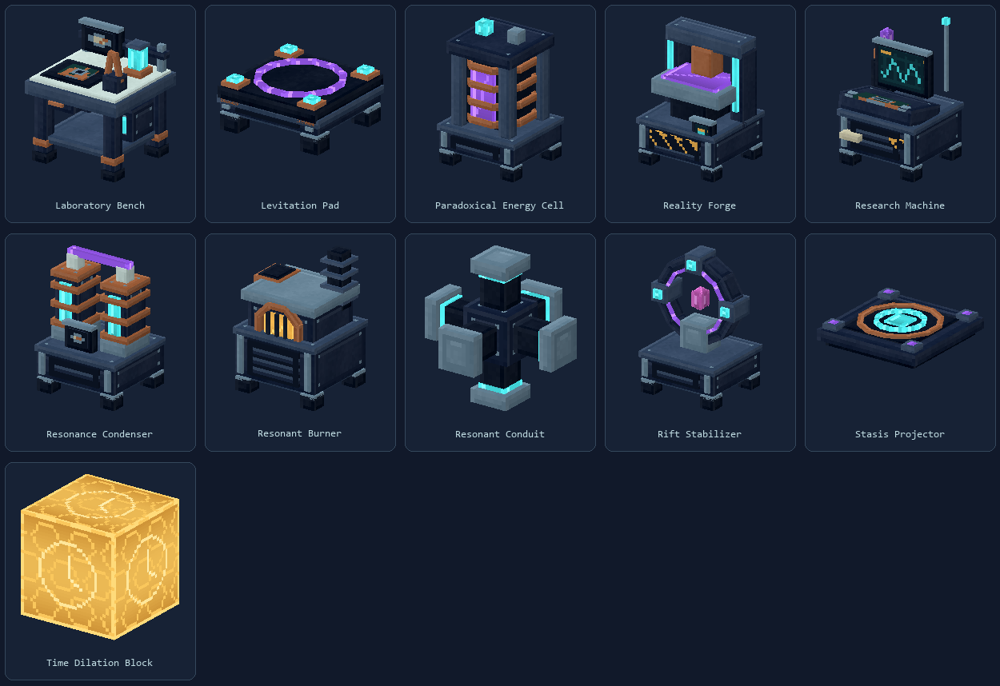

# Strange Matter for Hytale

A native Java 25 Hytale plugin and asset pack, converted from Gibson Hougland's Strange Matter for Minecraft 1.20.1. Study six kinds of anomaly, earn discipline-specific research points, stabilize experiments, condense anomaly shards, and build a mad-science laboratory.

The rebuilt visual identity uses dark navy housings, cyan instruments, purple resonance, copper coils and ceramic insulators. Every original registered item has a native model, UV atlas and inventory icon. The original Minecraft models and textures are not shipped.



## Install and build

Use Java 25, Python 3 and Hytale 0.6.4 to build. The project compiles against the locally installed September 7, 2026 server API; an API change can require rebuilding. Installing the packaged JAR does not require Python.

```powershell
./tools/build.ps1
```

The distributable is `build/libs/StrangeMatter-0.4.0.jar`. Put that one file in a Hytale server's `mods` directory, or the save's mods directory for a local world, and enable it. Replace the old mod JAR when updating; do not leave two versions enabled. It contains the plugin and assets. Keep the generated `mods/Hexvane_StrangeMatter` data directory when updating: research, machine inventories, hoverboard receipts, capsule identities and anomaly state live there. No separate Noesis or client Java installation is required.

For a server installed elsewhere:

```powershell
./gradlew.bat --no-daemon -PhytaleServerJar=C:/path/to/HytaleServer.jar build
```

`build` runs deterministic gameplay, recipe-reference and UI syntax checks. `tools/build.ps1` uses a cached Gradle 9.2.1 distribution, the shared Gradle cache used by Aetherhaven, and your installed server archive. Use `-PpythonExecutable=C:/path/to/python.exe` with Gradle to select another Python runtime. The project uses the same Hytale Gradle plugin workflow as Aetherhaven (pinned to 0.8.1). `runServer` runs against `build/resources/main` in the `run` directory and finalizes with `syncAssets`, copying asset-editor changes into `src/main/resources` after shutdown. The manifest is excluded. `runServerNoSync` uses the same server configuration without copying back. `syncAssets` can also be run manually. Old Strange Matter jars in `run/mods` are preserved under `run/legacy-mods` to avoid loading the previous implementation beside the development classes.

```powershell
./gradlew.bat runServer
# After stopping the server, editor changes have been copied to source.
./gradlew.bat runServerNoSync
./tools/verify-asset-sync.ps1
```

The [0.4.0 playtest revision](docs/REVISION-0.4.0.md) records the latest changes and verification. Model previews are in [playtest-revisions.png](docs/art/playtest-revisions.png), with the latest held-item icons in [selected-item-icons.png](docs/art/selected-item-icons.png).

## Start playing

1. New players receive a Research Tablet. Craft a Laboratory Bench at the workbench (one Workbench, four iron bars, two copper bars and six planks), then craft a Field Scanner there and explore for natural anomalies.
2. Hold the scanner on an anomaly for two seconds. Each natural anomaly awards 10 points of its discipline once per player. Transported anomalies do not become new scan rewards.
3. Open the tablet, read the original research descriptions and purchase a note whose prerequisites and six-currency costs you can afford.
4. Operate a Research Machine with the note in your inventory. Balance every active instrument together until instability reaches 5%. A failed or interrupted experiment leaves the note available to retry.
5. Feed a Resonant Burner, connect its faces to a Resonance Condenser with conduits, and place the condenser within ten blocks of an anomaly. Its shards and your unlocked research supply the Reality Forge.
6. Use the Echo Vacuum with an empty capsule to move an anomaly into your laboratory. Filled capsules are thrown; their field returns at impact.

The native research page preserves all six simultaneous experiments: cognition memory, energy amplitude/period, gravitational counterforce, projected shadow angle/distance, space distortion, and clock speed. Validated controls bypass Hytale's animation acknowledgement input gate; frame pacing pauses the simulation while a displayed frame awaits acknowledgement. Normal engine acknowledgements remain intact. See [research-port.md](docs/research-port.md) for the implementation, regression evidence and control adaptations.

## Anomalies and laboratory equipment

| Discipline | Field behavior | Products |
| --- | --- | --- |
| Gravity | Distorted gravity and levitating material | Gravitic shards, Graviton Hammer, levitation equipment |
| Time | Crop growth/regression and actual juvenile/adult livestock changes | Chrono shards, Chrono Blister |
| Energy | Hazardous discharges, grounding and extraction | Energetic shards, Rift Stabilizer |
| Space | Paired long-distance warp gates with safe arrival checks | Spatial shards, Warp Gun |
| Shadow | Echo creatures and perception effects | Shade shards, Echoform Imprinter |
| Cognition | Thoughtwell disorientation and temporary disguises | Insight shards, tinfoil shielding |

Layered native particle systems give the fields distinct cores, orbits, auras, motes and discharges. Identity, capture provenance, paired gates and first contacts survive restarts. [anomaly-port.md](docs/anomaly-port.md) documents effect radii, rarity, safety rules and engine adaptations.

Machine defaults retain the source balance: burner 20 RE/t, condenser 2 RE/t and one shard per 1,500 active ticks, rift extraction 100 RE/t with three stabilizers per rift, and a five-second forge. Conduit distance lowers throughput by 5% per block to a 10% floor; transferred energy is conserved. Routes are bounded and share conduit capacity. The creative Paradoxical Energy Cell supplies unlimited stored power.

The forge's native page selects an unlocked recipe and consumes its ordinary ingredients **plus** its separate shard requirements. Machine output and reserved crafting/fuel persist. Empty an operating machine before dismantling it. Stasis Projectors suspend specimens over a short beam pad; Levitation Pads show directional arrows across the usable shaft and switch between ascent and descent through their control page. The Echoform Imprinter reverts immediately on secondary/use, with crouch-primary retained. The Hoverboard uses a native mount, and the Echoform Imprinter changes the player's replicated appearance with restoration on exit; see [mobility-port.md](docs/mobility-port.md).

Anomaly Scientists offer the original fifteen trades across five ranks. Their furnished laboratory preserves the source structure and can appear beside suitable newly generated settlements. The Field Journal tracks all thirteen original milestones. [Scientists and progression](docs/worldgen/scientists-and-progression.md) explains the native settlement and profession adaptations.

## Commands

| Command | Access | Purpose |
| --- | --- | --- |
| `/sm journal` | Players | Open the research tablet |
| `/sm status` | Players | Display research points and observations |
| `/sm milestones` | Players | Open the Field Journal |
| `/sm kit` | `strangematter.admin` | Receive starter test instruments |
| `/sm spawn <type>` | `strangematter.admin` | Create a natural, scannable test field |
| `/sm locate [type]` | `strangematter.admin` | Locate an already discovered field |
| `/sm points <discipline> <amount>` | `strangematter.admin` | Add test research points |
| `/sm scientist` | `strangematter.admin` | Spawn an Anomaly Scientist nearby |
| `/sm save` | `strangematter.admin` | Flush machine, anomaly, scientist and milestone state |

Anomaly types: `gravity`, `temporal_bloom`, `energetic_rift`, `warp_gate`, `echoing_shadow`, `thoughtwell`. Research disciplines: `gravity`, `time`, `energy`, `space`, `shadow`, `cognition`.

## Assets, mappings and validation

The original conversion inventory contains 74 items, 45 registered blocks including the hidden generation marker, and 59 audited recipes. Version 0.4.0 registers 78 item assets including the Laboratory Bench and anomalous dirt; 49 recipes use native stations. The Strange Matter creative category contains every mod item. [content-mapping.json](docs/content-mapping.json) records every original item ID and the explicit vanilla ingredient substitutions. Native copper replaces redstone, white crystal replaces glass, fire essence replaces glowstone, and native wood-plank resource recipes accept the wood family. Recipe quantities and research costs are preserved.

See [art-direction.md](docs/art-direction.md) for original model construction, texture painting, UV allocation and regeneration order. `tools/assets/catalog.json` records the model paths, bounds and atlas sizes. `tools/finalize_assets.py` applies native collision, light, door, equipment attachment and placement properties after content/art generation. Do not regenerate only the item registry without running the finalizer afterward.

```powershell
python tools/convert_content.py
# Use a Python environment with Pillow and NumPy for art generation/finalization.
python tools/assets/build_assets.py
python tools/finalize_assets.py
python tools/assets/build_particles.py
python tools/prepare_audio.py
python tools/assets/build_gadget_effects.py
python tools/validate_presentation.py
python tools/validate_effects.py
python tools/validate_ui.py
./tools/build.ps1
./tools/validate.ps1 -SkipBuild
./tools/verify-native-world.ps1 -SkipBuild
```

Verification includes 1,050 seeded research simulations, 20,000 energy-transfer scenarios, 1,200 controls through the actual native UI acknowledgement gate at simulated high latency, research costs/prerequisites, input rejection, capsule nonce and rollback behavior, scan deduplication, persistent livestock aging, all forge recipe gates, UV bounds, native resource references and static UI selector validation. The native loader runs in `build/validation-run`; its output is `asset-validation.log`. Optional `-ValidateBaseInstances` also validates vanilla instance templates; the installed September server currently rejects its own zip-backed instance paths during that broader check.

The [native world smoke test](docs/native-world-verification.md) starts an isolated flat world without opening network ports or loading an existing save. It asserts native custom-block placement, actual gathering drops, burner generation, chrono field creation/expiry, and reserved-input metadata/durability persistence, then shuts down. Results and logs are written under `build/native-world-run`; the test plugin is excluded from the release jar.

The [verification report](docs/verification.md) records the tested server revision, release hash and exact results. Automated and loader checks cannot establish client layout quality, multiplayer latency, controller feel or every live physics interaction. Those require the [in-game acceptance pass](docs/acceptance.md). The provided render sheets are offline renders of the exported models, not screenshots from Hytale.

MIT license, preserving the original project's copyright notice.
