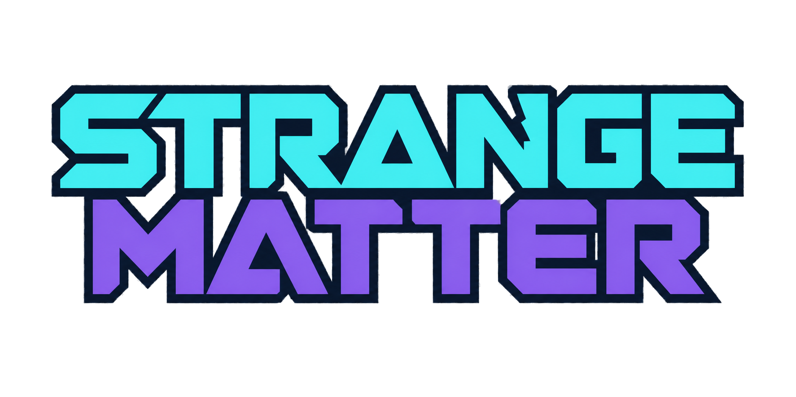

# Strange Matter

Strange Matter brings mad science to Hytale. Explore strange places, study powerful anomalies and build a laboratory that turns your discoveries into useful inventions.

## Discover the impossible

Find six kinds of anomaly hidden across the world. Some bend gravity or twist time. Others crackle with energy, connect distant places, cast living shadows or cloud your thoughts.

Each kind has its own dangers and rewards. Scan them to learn more, find the strange minerals around them and bring their power into your experiments.

Near a Thoughtwell, a blue haze clouds your sight. Your steps slow as creatures appear at the edge of your sight, rush closer and vanish. False footsteps make it harder to trust what you hear. A Tinfoil Hat keeps your thoughts clear.

## Learn through experiments

Your Research Tablet helps you keep track of discoveries and choose what to study next. Prepare research notes, place them in a Research Machine and solve experiments to unlock new inventions.

Each discovery adds pages to your journal. Read them to learn how your new equipment works and what to try next.

## Build your laboratory

Start with a Laboratory Bench, then grow your workshop into a room full of strange machines. Burn fuel for power, connect machines with conduits and use a Resonance Condenser to collect shards from nearby anomalies.

The Reality Forge turns materials and shards into equipment you have learned to make. Capture anomalies in containment capsules and move them where you need them.

Energetic Rifts are dangerous to approach. An active Rift Stabilizer draws power from a nearby rift and stops it from shocking nearby creatures. A Tinfoil Hat can also protect you from its shocks.

## Put your discoveries to work

Link distant places with the Warp Gun. Move heavy stone with the Graviton Hammer. Ride across the land on a Hoverboard, lift yourself with Levitation Pads or borrow another creature's appearance with the Echoform Imprinter.

Keep unusual finds floating above a Stasis Projector and fill your laboratory with glowing crystals, lamps and lanterns. Trade Life Essence with Anomaly Scientists as you explore what else the world has to offer.

## Begin your first experiment

Craft a Laboratory Bench and a Field Scanner. Find an anomaly and scan it, then open your Research Tablet to choose a topic. Prepare a note and take it to a Research Machine.

One discovery is all it takes to start something strange.

All rights reserved. See the [license](LICENSE.txt).
