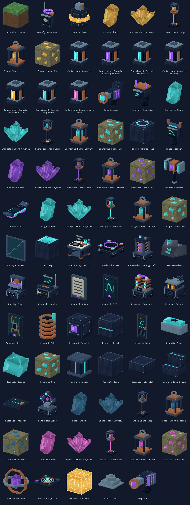
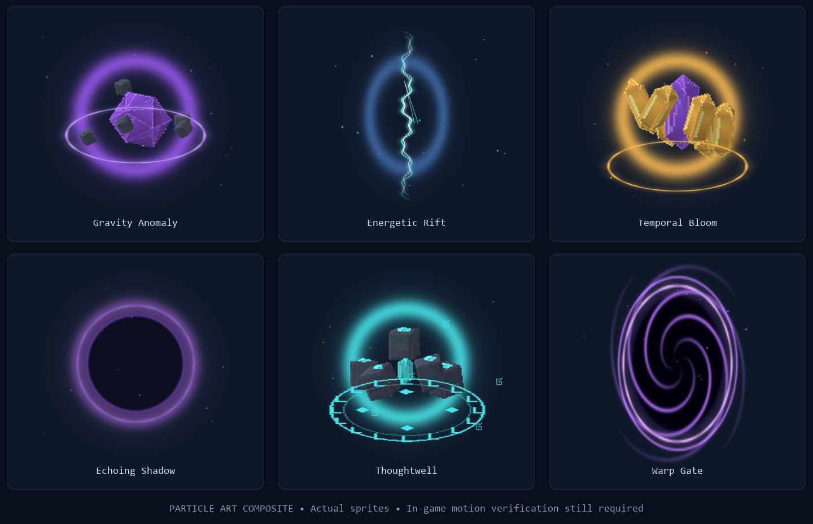

# Strange Matter: Hytale art implementation

## Current edited-art workflow

The latest targeted revision was preserved in `build/art-preservation/20260909T083748312884Z/Resources.zip`, with a SHA-256 manifest covering all 899 pre-edit resource files. It changes the scanner's global yaw by 180 degrees and the hammer's by 90 degrees, leaving their local geometry, UVs and node hierarchy intact. Only those two existing inventory icons were refreshed. The new anomalous dirt block adds its own 64×64 icon and reuses the saved `Anomalous_Grass_Soil.png` bitmap on a native cube. [selected-item-icons.png](art/selected-item-icons.png) shows the three exports; these are offline previews, so held alignment still needs a client view.

[validate_asset_polish.py](../tools/validate_asset_polish.py) compares this revision with its complete archive. It verifies 220 original model/texture files byte-for-byte, 24 exact shared-model aliases, two root-transform-only rotations, and 84 untouched existing icons. All 78 registered items now have specific functional or material descriptions in `Server/Languages/en-US/server.lang`; [content_policy.py](../tools/assets/content_policy.py) supplies the same descriptions to content tooling. This preservation audit is a record of this revision: later intentional edits should be assessed against their own snapshot, while the presentation validator remains the routine current-asset check.

The user's current model and texture edits are authoritative. The preceding 0.3 revision was preserved in `build/art-preservation/20260909T073450922979Z/Common.zip`, with a SHA-256 manifest beside it. That targeted revision changed the six standing lamps, raw resonite, Shade-family colors, hat attachment hierarchy and requested icons. Its final preservation audit found **zero unexpected changes**, with 319 original Common files byte-identical. [manual-art-preservation.json](../tools/assets/manual-art-preservation.json) records that earlier revision.

Use [render_current_icons.py](../tools/assets/render_current_icons.py) to refresh inventory icons after editing existing art. It reads the current native item, model and texture files, applies UV mirrors/rotations, inherits each node's rotated shape offset through its children, and includes the actual native cube host for `CubeWithModel` ores. It does not regenerate models or textures. The 0.3 gallery contains 77 item icons at exactly 64×64 in [current-item-icons.png](art/current-item-icons.png); the selected preview above records the subsequent scanner, hammer and new dirt exports. There are now 78 registered items.

```powershell
python tools/assets/preserve_current_art.py --resources
& 'C:/Users/gchou/.cache/codex-runtimes/codex-primary-runtime/dependencies/python/python.exe' tools/assets/render_current_icons.py --preview
python tools/validate_presentation.py
python tools/validate_recipes.py
```

The first command creates a complete resource archive and hash manifest without changing existing assets; omit `--resources` for a Common-only snapshot. The renderer needs Pillow and NumPy, supplied by the bundled interpreter shown here. On another machine, substitute a Python environment containing those libraries. The validators need only standard Python. Run the renderer after finishing model/texture edits so inventory icons reflect the final saved art. For selected edits, append `--items SM_Field_Scanner SM_Graviton_Hammer` to render only those item IDs; other icons and the full gallery stay untouched.

The broad original `build_assets.py`, `convert_content.py` and `finalize_assets.py` stages would replace current manual edits. They are archived reset tools, not part of this workflow. [apply_playtest_art_revision.py](../tools/assets/apply_playtest_art_revision.py) is the narrowly scoped implementation of this specific revision; rerunning it deliberately replaces its named lamp/raw-material targets. [build_scientist_art.py](../tools/assets/build_scientist_art.py) replaces only the generated scientist variant. Neither targeted tool is needed merely to refresh icons.

The revised lamps stand two blocks tall on a weighted base, with an illuminated stem, brass collars and a suspended crystal inside the upper cage. Lantern geometry remains untouched. Raw resonite is now an irregular mineral-bearing rock cluster. Shade uses deep spectral blue/teal `#3B779D`; Gravitic remains violet. Existing Shade textures were recolored only in their purple mineral pixels, preserving the other painted surfaces and UVs. [targeted-playtest-revisions.png](art/targeted-playtest-revisions.png) compares the resulting fixtures and materials.

The worn tinfoil hat again has an empty native `Head` attachment piece, retaining the edited brim and crown as its children. Its fit places the brim 0.4 model units above the native scalp plane in the complete native player rig. [tinfoil-player-fitting.png](art/tinfoil-player-fitting.png) shows front and angled views; this is an offline attachment fitting check, not a captured client frame.

`SM_Klops_Scientist` inherits the native Klops animation rig and adds 70 custom nodes: split white labcoat, sleeves, a large cyclops safety goggle with magnifier, identification badge, probes, belt and cyan/violet reagent tanks. Native tail, eyebrow and shoe attachments remain available. Its model and 256×512 texture are `Common/NPC/StrangeMatter/Scientist/Scientist.blockymodel` and `Scientist.png`. [scientist-wardrobe.png](art/scientist-wardrobe.png) shows three views.

The creative tab now follows the native root-plus-child structure: `SM_StrangeMatter` contains `All`, and items use `SM_StrangeMatter.All`. The root has an 88-pixel flask plate at `Icons/ItemCategories/SM_StrangeMatter.png`; its child has a 48-pixel monochrome glyph at `Icons/ItemCategories/SM_StrangeMatter_All.png`. These category images have native category dimensions; inventory item icons remain 64×64. This corrects the concrete null-children discrepancy found while investigating the native client click crash; the obfuscated client stack alone cannot prove its exact internal failing call.

The laboratory crafting bench uses item `SM_Laboratory_Bench` and native bench ID `SM_Laboratory`. Its **Strange Matter** category is `SM_Laboratory_All`; **Shards & Lighting** is `SM_Laboratory_Shards`, containing shard/crystal/lamp/lantern recipes and its own 48-pixel crystal icon. The bench itself is crafted at the vanilla workbench from one workbench, four iron bars, two copper bars and six planks of any kind. Other former workbench recipes use the laboratory bench. Native Crafting recipes set `KnowledgeRequired: true`; the research bridge grants their actual recipe IDs. Processing furnace recipes keep their separate native behavior, and custom Reality Forge recipes retain their own research gates.

Stackable materials and ordinary building blocks hold 100, fixtures/machines/blank research notes and empty capsules hold 25, and tools, the hat and filled identity capsules remain singleton items. [validate_presentation.py](../tools/validate_presentation.py) checks these constraints, category children, crafting gates, tabs and model/icon dimensions. Eight negative/baseline presentation cases and five native transform/UV/visibility/ore-host rendering fixtures passed.

## Shared family models and lighting

Only exactly identical parsed model files were consolidated, including node names, geometry, UV transforms, attachment flags and LOD properties. Each item retains its own original texture. [shared-models.json](../tools/assets/shared-models.json) records all 24 old paths and their six replacements. Resource references and the tooling catalog now point to the shared models; obsolete duplicate files were removed only after comparison with the archive.

| Saved shared model, beneath `Common` | Item families |
| --- | --- |
| `Items/StrangeMatter/Shared/shard_1c8e23d7fc2c.blockymodel` | All six shards |
| `Blocks/StrangeMatter/Shared/shard_crystal_84dcace58934.blockymodel` | All six crystals |
| `Blocks/StrangeMatter/Shared/shard_lamp_f9d17c298777.blockymodel` | Gravitic, Chrono, Energetic, Insight lamps |
| `Blocks/StrangeMatter/Shared/shard_lamp_94de2407eff5.blockymodel` | Spatial and Shade lamps |
| `Blocks/StrangeMatter/Shared/shard_lantern_abcc9021638d.blockymodel` | Gravitic, Chrono, Energetic, Insight lanterns |
| `Blocks/StrangeMatter/Shared/shard_lantern_32a79ecdec17.blockymodel` | Spatial and Shade lanterns |

The two lamp groups preserve a real edited stem/UV difference; the two lantern groups also preserve their distinct exported data. Editing a shared file changes every listed family. To create a unique variant, copy its shared model, point that item's `Model` or `BlockType.CustomModel` at the copy, and retain or update the matching texture. The normal icon renderer follows the current item reference and does not merge models.

All six lamp and lantern light colors are exactly three times their corresponding crystal's channel values. In family order Gravitic, Chrono, Energetic, Spatial, Shade and Insight, crystal colors are `#325`, `#542`, `#255`, `#525`, `#235`, `#255`; fixtures use `#96f`, `#fc6`, `#6ff`, `#f6f`, `#69f`, `#6ff`. This preserves hue while raising maximum emitted brightness from 5 to 15. ColorLight channels are native light intensities, not ordinary bitmap colors.

[apply_asset_polish.py](../tools/assets/apply_asset_polish.py) is the implementation record for this particular revision. It requires the original complete snapshot, checks transforms against that baseline, and compares models exactly before consolidation. It is not an automatic post-edit step: later deliberate changes should be preserved and reviewed independently. The normal build and icon renderer do not run it.

## Original art construction reference

The rebuilt art keeps the original mod's mad-science identity: midnight navy machinery, turquoise instrumentation, violet resonance, copper windings, pale ceramic insulators, and exposed apparatus. Warm gold marks chronal material; rose marks spatial material. Equipment is deliberately legible in silhouette and at Hytale inventory scale.

All 74 registered Minecraft items and 45 registered blocks are covered. The original port catalog recorded 84 model entries, including the laboratory bench, hidden marker, six anomaly cores and cyan/violet personal gate variants. Later consolidation shares identical geometry, and new runtime entities may have additional models. The current registered inventory has 78 items and the exported icon directory has 87 images, all exactly **64×64**. Minecraft models and textures were used as design references; their geometry and bitmaps are not shipped.

## Machines

| Machine | Rebuilt silhouette and identifying details |
| --- | --- |
| Research machine | Raised oscilloscope, sloped keyboard console, specimen crystal, aerial, controls, note tray |
| Resonant burner | Copper firebox aperture, visible plasma behind iron bars, fuel hopper, finned flue |
| Resonance condenser | Twin ceramic-capped induction towers, copper windings, luminous condensate windows, bus bridge |
| Reality forge | Reinforced gantry, suspended quantum press, energized anvil, warning strip |
| Rift stabilizer | Segmented containment arch, three field clamps, inner conductor, suspended spatial seed |
| Paradoxical energy cell | Armoured corner cage, stacked conductor bands, opposite terminal posts |
| Stasis projector | Small floor pad, upward cyan emitter, copper focus ring, violet corner status lamps |
| Time dilation block | Full golden forcefield cube, hexagonal cells, clock-face ripples; traversable field material |
| Levitation pad | Four corner coils and a horizontal segmented resonance seal |
| Resonant conduit | Compact isolated hub; only connected faces gain insulated arms and illuminated couplings |
| Laboratory bench | Ceramic worktop, circuit under test, sample vial, probe cup, instrument rail and powered lower shelf |



The initial machine construction views remain archived in [machine-turnarounds.png](art/machine-turnarounds.png); the current gallery above reflects the user's saved edits. Handheld equipment has purpose-built grips, lenses, reservoirs, emitter cages and controls. Shards use pointed crystal geometry; lanterns expose the suspended crystal inside a metal cage. Building blocks remain modular. Crystal clusters bloom from a shared root with six outward petals and no stone pedestal. Ores use native `CubeWithModel`: ordinary Hytale stone supplies the complete host cube, while angled mineral nodules form the embedded ore model.

## Native geometry and texture construction

Hytale model coordinates use **32 units per world block**. Models use the native `.blockymodel` `box` and `quad` shape formats with normalized quaternion rotations. The original gravity anomaly's icosahedron is reproduced with twenty triangular faces carried by alpha-cut native quads. Crystal points use the same technique. This follows Hytale's own use of alpha-cut quads in `Resources/Crystals/Crystal_Fragment.blockymodel`, and avoids unsupported arbitrary mesh geometry.

Each visible face receives an explicit `textureLayout` entry. Every face has a dedicated atlas rectangle with one texel of extruded padding. Box face dimensions follow the exported integer model dimensions; fractional world sizes use `stretch`. Triangle tips receive denser face texels and transparent off-triangle regions. Atlases have power-of-two dimensions of at least 32 pixels on both axes, satisfying the native client's 32-pixel multiple requirement. Original pixel painting combines tonal strokes, edge wear, bevel highlights, copper windings, screens and warning marks. The ore preview deliberately reuses Hytale's ordinary stone texture, matching the native stone host used in game.

The initial generated construction is recorded in [build_assets.py](../tools/assets/build_assets.py) and [catalog.json](../tools/assets/catalog.json). Those files predate subsequent manual edits, so their recorded node counts, UV layouts and bounds are historical. Current models, textures and item JSONs are authoritative; the icons-only renderer reads those files directly. Asset references omit the `Common/` prefix as required by Hytale.

The original generation checks are archived in [validation.json](../tools/assets/validation.json). Current icons-only verification is [current-icon-validation.json](../tools/assets/current-icon-validation.json), and manual preservation is checked against the backup manifest. [validate_presentation.py](../tools/validate_presentation.py) runs with standard Python and checks icon/model-atlas dimensions, all 64 conduit masks, native recipe stations and gates, creative child categories, stack sizes and particle sprite references. Particle sprites retain their native frame dimensions and are not restricted to inventory-icon sizes. Review sheets are offline renders.

## Anomalies

All six anomaly families have layered Hytale particle systems, with independent core, aura, orbit, fragment and environmental layers:

| System ID | Visual language and motion |
| --- | --- |
| `SM_Gravity_Anomaly` | Violet icosahedron, pale tilted orbital ring, floating rock fragments, inward dust |
| `SM_Energetic_Rift` | Jagged cyan fissure, broad electric corona, short branching arcs, fast sparks |
| `SM_Temporal_Bloom` | Gold and lilac crystal bloom, expanding chronal ripple, floating petals, slow light motes |
| `SM_Echoing_Shadow` | Light-absorbing navy centre, faint purple echo ring, inward smoke, dark fragments and whispers |
| `SM_Thoughtwell` | Floating rune-bearing stones, turquoise glyph seal, circulating symbols and rising ideas |
| `SM_Warp_Gate` | Tall dark event horizon, counter-rotating spiral and rim, falling spatial sparks |



`SM_Anomaly_Capture`, `SM_Anomaly_Scan`, and `SM_Rift_Discharge` provide distinct interaction feedback. `SM_Resonant_Burner_Active` and `SM_Resonance_Transfer` are supplementary machine effects. The initial anomaly pack contained 11 systems, 40 spawners and 18 sprites; current gadget and machine effects extend that graph. The presentation validator reports the current referenced assets. Core silhouettes are also available as textured billboards.

The original anomaly field systems support one-second pulses with finite emitters, explicit particle budgets and tails that finish after emission stops. Gadget bursts and newer machine effects use their own shorter timing and culling values; consult their current resource JSONs. Particle generation is separate from refreshing item icons.

`ParticleAnimationFrame` source confirms that animation scale and opacity multiply the initial values. The generator therefore starts with nonzero initial opacity, uses unit animation scale at birth, and fades in/out through animation keys. The 128-pixel sprites are scaled from Hytale's 32-pixel world units. Final apparent sizes, depth ordering, billboard-facing effects and spawn timing still need an in-game visual pass against the installed client.

[build_particles.py](../tools/assets/build_particles.py) is the initial anomaly-particle generator, with gadget additions maintained separately. [particle-catalog.json](../tools/assets/particle-catalog.json) records its original graph. Source schema references are the supplied Hytale `ParticleSpawner`, `ParticleSystem`, `ParticleSpawnerGroup`, `ParticleAttractor` and `ParticleAnimationFrame` classes. The particle sheet is an art composite, not a captured Hytale frame.

## Archived generators: intentional reset only

**Running the broad generators replaces saved edits.** Use them only when deliberately resetting the project to generated art/content. First preserve the complete resource directory with `preserve_current_art.py --resources` and retain its ZIP and hash manifest. Common-only backups do not include recipes, categories or item definitions. Work on a separate copy when comparing generated output with edited assets.

| Archived tool | What an intentional run replaces |
| --- | --- |
| `build_assets.py` | The original model/texture/icon set and generated catalog |
| `convert_content.py` | Native item definitions, recipes and generated localization |
| `finalize_assets.py` | Hitboxes, door/hat hierarchies, model variants, item/category integration and prefab decorations |
| `build_particles.py` / `build_gadget_effects.py` | Their generated particle graphs, sprites and related feedback assets |

These scripts are construction references, not a round-trip serializer for the current edited release. They do not preserve every subsequent manual revision or the latest targeted content patches. After any intentional reset, review the complete diff and restore or reapply the desired edits before running the current icons-only renderer and validators. There is no broad reset step in the normal build or icon-refresh instructions above.

## Native block integration

Model-derived block coordinates use `x/32 + .5`, `y/32`, `z/32 + .5`. Stairs have separate step colliders. Conduits have 64 model/collision variants; their bit directions are +X, −X, +Y, −Y, +Z, −Z. `VariantRotation: None` keeps connections on world axes. The runtime selects `Connection00` through `Connection63` from adjacent network members. [conduit-connections.png](art/conduit-connections.png) shows representative configurations.

Doors use native `Door`/`Door_Horizontal` interactions, opening/closing animations and matching swung hitboxes. Current edited models retain a named `SM_Hinge` node and closed-pose animation. An editor may merge geometry into that hinge, so either a valid box or empty-group shape is accepted; the validator does not replace the user's hierarchy. Block lighting uses Hytale's three-digit `ColorLight` syntax.

The two original prefab decorations are a thin cyan laminated pane and a navy ceiling light with cyan diffusers. Their construction record is [lab-details-catalog.json](../tools/assets/lab-details-catalog.json); the current files remain authoritative. Their bounds are one block across, and the pane is 2/32 block thick.

## Building and gathering parity

Crystal blocks use native `DoublePipe` orientation, exposing all six mounting faces. Pillars use three-axis `Pipe`; stairs support upright and inverted NESW rotations. Slabs use the native `Half_Block` interaction and a full-tile state: adding a second half consumes a slab, and breaking the doubled block returns two slabs. Doors and hatches use native opening interactions and retain their separate swung collision boxes.

Full-cube ores, resonite blocks, tiles and grass retain exactly `[0,1]` collision on each axis. Ornamental inlays and mineral faces do not reserve neighboring filler cells. The hatch hinge sits slightly inside its frame at model `(0,3,13)`; its native 90-degree opening remains within a single cell. The scientist laboratory checker verifies the rotated collision footprints of the complete current prefab.

All seven ores require the native iron pickaxe's `Rocks` quality of 3 and drop 1–2 raw resonite or corresponding shards, matching the unenchanted Minecraft source. Resonite blocks also require iron quality. Native gathering does not reproduce Minecraft Fortune or Silk Touch enchantments. Crystals emit a maximum color channel of 5, lamps and lanterns 15, and anomalous grass 3; these are Hytale light levels rather than full-bright RGB tints with an arbitrary radius.

Anomalous grass now uses Hytale's native grass cube layout with separately painted leafy green top, hanging turf sides and warm soil bottom. Soil gathering, dirt drops, grass sounds/particles and native ground transitions remain. There is no till interaction or use prompt. Its custom `AnomalousGrassService` runs through loaded-section random ticks: a 1/100 trial selects one neighbor in the original 3×3×3 range, converting only native grass. A solid opaque covering reverts it to dirt on its next random tick. This preserves growth without scanning worlds or loading distant chunks; conversion under a newly placed covering waits for a random tick.

`SM_Anomalous_Dirt` gives terrain conversion a separate underlying soil block. It inherits the native soil template, uses the existing grass-soil bitmap on every face, drops itself through native soil gathering and has a `[0,1]` solid collider. It has no recipe or use interaction, stacks to 100 and appears in the Strange Matter creative category.
